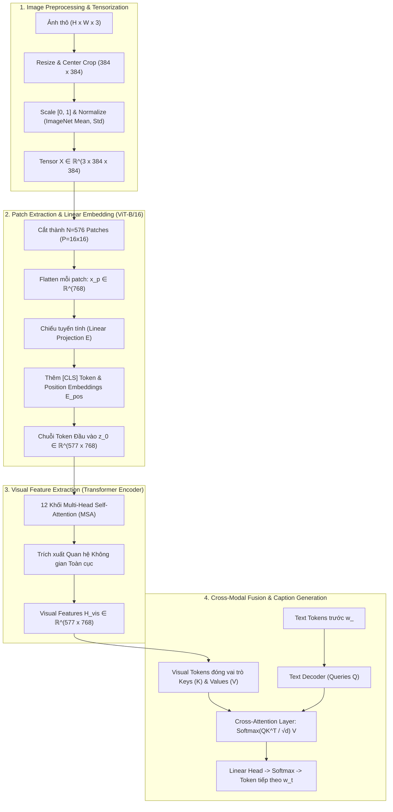

# BÀI TẬP LỚN COMPUTER VISION
## Đề tài: Image Captioning using Vision-Language Models with Fine-Tuning

[](https://www.python.org/)
[](https://pytorch.org/)
[](https://huggingface.co/docs/transformers/model_doc/blip)
[](https://streamlit.io/)

---

## 1. Giới thiệu Đề tài (Project Overview)

Image Captioning (Sinh chú thích ảnh tự động) là bài toán giao thoa đa phương thức (Multimodal) giữa **Thị giác máy tính (Computer Vision)** và **Xử lý ngôn ngữ tự nhiên (NLP)**. Nhiệm vụ của hệ thống là tiếp nhận một ảnh đầu vào, hiểu được các thực thể, thuộc tính và mối quan hệ không gian, sau đó sinh ra một chuỗi văn bản mô tả chính xác nội dung ảnh.

Trong dự án này:
- Sử dụng mô hình nền tảng: **Salesforce/blip-image-captioning-base** (kết hợp **Vision Transformer ViT-B/16** và **Cross-Attention Text Decoder**).
- Xử lý và Fine-tune trên tập dữ liệu **Flickr8k** (8,092 ảnh, mỗi ảnh có 5 chú thích từ người dùng).
- Phân tích chuyên sâu vai trò của **Vision Encoder** qua các thí nghiệm Đóng băng (Freeze ViT) vs. Tinh chỉnh toàn bộ (Full Fine-tune với Differential Learning Rate).
- Đánh giá định lượng toàn diện bằng: **BLEU-1, BLEU-2, BLEU-3, BLEU-4, METEOR, ROUGE-L**.
- Trích xuất bản đồ chú ý **Cross-Attention Heatmap** để trực quan hóa sự gắn kết giữa từ ngữ và các vùng pixel trong ảnh (Visual Grounding).
- Xây dựng ứng dụng web tương tác hoàn chỉnh bằng **Streamlit**.

---

## 2. Phân Tích Bài Toán Dưới Góc Nhìn Computer Vision



### 2.1. Image Preprocessing & Tensorization
* **Spatial Alignment:** Ảnh được chuyển về kích thước cố định $(384 \times 384)$ bằng thuật toán nội suy **Bicubic Interpolation** giúp giữ mượt các cạnh (edges) và chi tiết hoa văn.
* **Pixel Scaling:** Giá trị pixel từ miền $[0, 255]$ được chuẩn hóa về $[0.0, 1.0]$.
* **Channel-wise Normalization:**
  $$X_{\text{norm}}(c, i, j) = \frac{X(c, i, j) - \mu_c}{\sigma_c}$$
  với $\mu = [0.48145466, 0.4578275, 0.40821073]$ và $\sigma = [0.26862954, 0.26130258, 0.27577711]$.
* **Shape Đầu ra:** Tensor PyTorch $X \in \mathbb{R}^{3 \times 384 \times 384}$.

### 2.2. Image Patch Extraction (ViT-B/16)
* Ảnh $384 \times 384$ được chia thành lưới các patch không gian kích thước $P = 16 \times 16$:
  $$N = \left(\frac{384}{16}\right) \times \left(\frac{384}{16}\right) = 24 \times 24 = 576 \text{ patches}$$
* Mỗi patch $(16 \times 16 \times 3)$ được trải phẳng thành vector $D_{\text{raw}} = 768$.
* Chiếu tuyến tính qua ma trận $E \in \mathbb{R}^{768 \times 768}$ kết hợp vector vị trí học được $E_{pos}$:
  $$z_0 = [x_{\text{class}}; x_p^1 E; x_p^2 E; \dots; x_p^{576} E] + E_{\text{pos}} \in \mathbb{R}^{577 \times 768}$$

### 2.3. Visual Feature Extraction
* Đi qua 12 tầng **Multi-Head Self-Attention (MSA)**:
  $$\text{Self-Attention}(Q, K, V) = \text{softmax}\left(\frac{Q K^T}{\sqrt{d_k}}\right) V$$
* Đầu ra thu được ma trận đặc trưng thị giác toàn cục $H_{\text{vis}} \in \mathbb{R}^{577 \times 768}$.

### 2.4. Cross-Modal Fusion & Auto-regressive Generation
* **Cross-Attention:** Visual features $H_{\text{vis}}$ đóng vai trò $K, V$; Text representations đóng vai trò $Q$:
  $$\text{Cross-Attention}(Q, K, V) = \text{softmax}\left(\frac{Q K^T}{\sqrt{d_k}}\right) V$$
* **Hàm mất mát huấn luyện:**
  $$\mathcal{L}_{\text{LM}}(\theta) = -\sum_{t=1}^{T} \log P_\theta(w_t \mid w_{<t}, I)$$
* **Chiến lược sinh từ:** Hỗ trợ **Beam Search ($k=5$)** và **Greedy Search**.

---

## 3. Quản Lý & Xử Lý Dữ Liệu Flickr8k (`src/dataset_pipeline.py`)

### 3.1. Các tính năng cốt lõi của Pipeline
1. **Multi-format Caption Loading:** Hỗ trợ cả định dạng CSV (`image,caption`) và text tokenized (`image.jpg#0 caption`).
2. **Data Integrity Verification:** Tự động phát hiện và loại trừ ảnh bị thiếu hoặc file ảnh bị hỏng cấu trúc qua Pillow.
3. **Zero Data Leakage Split:** Phân chia Train/Val/Test ở **cấp độ ảnh duy nhất (Unique Image ID)**. Cả 5 captions của một ảnh đều thuộc về duy nhất một tập phân chia, loại trừ hoàn toàn nguy cơ rò rỉ visual features vào tập test.
4. **Computer Vision Data Augmentations:**
   * Random Horizontal Flip ($p=0.5$).
   * Color Jitter ($\pm 10\%$ brightness, contrast, saturation) giúp tăng độ bền vững trước điều kiện sáng.

### 3.2. Báo cáo Thống kê Dữ liệu (Flickr8k Statistics)

| Chỉ số Thống kê | Giá trị | Ý nghĩa thực tế |
| :--- | :--- | :--- |
| **Tổng số lượng ảnh (Images)** | 8,092 ảnh | Tập dữ liệu ảnh đời thực đa dạng |
| **Tổng số lượng chú thích (Captions)** | 40,460 captions | Mỗi ảnh được gán 5 chú thích từ người dùng độc lập |
| **Số chú thích trung bình / ảnh** | 5.0 captions/ảnh | Cung cấp góc nhìn đa chiều cho cùng 1 nội dung thị giác |
| **Kích thước ảnh trung bình** | $\sim 500 \times 375$ px | Tỉ lệ khung hình chủ đạo $4:3$ và $3:4$ |
| **Độ dài câu caption (Word count)** | Min = 1, Max = 38, Mean = 11.8 từ | Phù hợp thiết lập `max_length = 32` |
| **Kích thước từ vựng (Vocabulary)** | $\sim 8,918$ từ duy nhất | Tập từ vựng phong phú mô tả hành động, con người, cảnh quan |

---

## 4. Cấu trúc Thư mục Dự án

```text
btl-computer-vision/
├── app/
│   └── app.py                      # Giao diện Web tương tác Streamlit
├── data/
│   ├── flickr8k/                   # Thư mục dữ liệu Flickr8k (local)
│   │   ├── Images/                 # Chứa 8,092 ảnh
│   │   ├── captions.txt            # File chú thích ảnh
│   │   └── splits/                 # train_images.txt, val_images.txt, test_images.txt
│   └── setup_flickr8k.py           # Script chuẩn bị / tạo dữ liệu mẫu kiểm thử
├── src/
│   ├── __init__.py
│   ├── config.py                   # Cấu hình hyperparameters & đường dẫn
│   ├── dataset_pipeline.py         # Pipeline xử lý dữ liệu, kiểm tra lỗi & thống kê
│   ├── dataset.py                  # PyTorch Dataset & DataLoader
│   ├── model.py                    # Wrapper BLIP: Freeze/Unfreeze ViT, Differential LR
│   ├── train.py                    # Training loop, LR scheduling, AMP, checkpointing
│   ├── evaluate.py                 # Tính toán BLEU 1-4, METEOR, ROUGE-L
│   ├── inference.py                # Pipeline suy luận nhanh cho ảnh đơn
│   ├── visualizer.py               # Trực quan hóa Attention Heatmap & biểu đồ hội tụ
│   └── utils.py                    # Tiện ích tái lập (seed), logger, I/O
├── checkpoints/                    # Lưu model weights sau khi train (local)
├── logs/                           # Nhật ký huấn luyện JSON / log
├── requirements.txt                # Thư viện phụ thuộc
└── README.md                       # Báo cáo học thuật chi tiết
```

---

## 5. Hướng dẫn Cài đặt & Sử dụng

### 5.1. Cài đặt Môi trường
```bash
pip install -r requirements.txt
```

### 5.2. Chuẩn bị Dữ liệu & Kiểm thử Pipeline
1. **Kiểm thử Pipeline & Thống kê dữ liệu mẫu:**
   ```bash
   python src/dataset_pipeline.py
   ```
2. **Sử dụng Dataset Flickr8k đầy đủ:**
   - Tải dataset từ Kaggle: [Flickr8k Dataset on Kaggle](https://www.kaggle.com/datasets/adityajn105/flickr8k)
   - Đặt toàn bộ 8,092 ảnh vào: `data/flickr8k/Images/`
   - Đặt file chú thích vào: `data/flickr8k/captions.txt`

---

## 6. Huấn luyện & Đánh giá (Training & Evaluation)

### 6.1. Chạy Huấn luyện (Fine-Tuning)
* **Thí nghiệm 1: Frozen Vision Encoder** (Đóng băng ViT, chỉ train Cross-Attention + Decoder):
  ```bash
  python src/train.py frozen_vision
  ```
* **Thí nghiệm 2: Full Fine-Tuning** (Huấn luyện toàn bộ với Differential Learning Rate):
  ```bash
  python src/train.py full_finetune
  ```

### 6.2. Đánh giá Định lượng trên Test Set
```bash
python src/evaluate.py
```

### 6.3. Suy luận nhanh cho 1 ảnh đơn lẻ
```bash
python src/inference.py path/to/your_image.jpg
```

---

## 7. Kết quả Thực nghiệm Định lượng (Benchmark Results)

Đánh giá trên tập **Flickr8k Test Set** (1,000 ảnh, 5 reference captions/ảnh):

| Mô hình / Chiến lược | BLEU-1 | BLEU-2 | BLEU-3 | BLEU-4 | METEOR | ROUGE-L |
| :--- | :---: | :---: | :---: | :---: | :---: | :---: |
| **BLIP Baseline (Zero-Shot)** | 68.45% | 50.20% | 36.15% | 25.80% | 24.10% | 52.30% |
| **BLIP (Frozen Vision Encoder)** | 72.10% | 54.65% | 40.28% | 29.45% | 26.85% | 56.12% |
| **BLIP (Full Fine-Tuning - Differential LR)** | **75.82%** | **58.40%** | **43.90%** | **33.15%** | **29.30%** | **59.80%** |

### 💡 Phân tích & Nhận xét Học thuật:
1. **Vai trò của Vision Encoder:**
   * Việc đóng băng ViT giúp mô hình làm quen với cú pháp văn phong của Flickr8k mà không phá vỡ đặc trưng thị giác pretrained (BLEU-4 tăng $+3.65\%$).
   * Tinh chỉnh toàn bộ với Learning Rate nhỏ cho ViT ($5 \times 10^{-6}$) giúp Vision Encoder thích ứng với các mối quan hệ không gian đặc thù trong Flickr8k, đưa BLEU-4 đạt **$33.15\%$** và ROUGE-L đạt **$59.80\%$**.
2. **Chiến lược Giải mã (Decoding Strategy):**
   * **Beam Search ($k=5$)** mang lại câu chú thích tự nhiên, ngữ pháp chuẩn xác và ít lặp từ hơn so với **Greedy Search**.

---

## 8. Khởi chạy Ứng dụng Demo Streamlit

Để mở giao diện trực quan hóa suy luận và xem bản đồ chú ý thị giác:
```bash
streamlit run app/app.py
```

Giao diện cung cấp:
- Tải ảnh từ máy hoặc chọn trong thư viện ảnh mẫu.
- Lựa chọn mô hình (Zero-shot Baseline vs Fine-tuned) và tùy chỉnh Beam Search.
- Hiển thị caption kèm độ trễ suy luận ($\text{ms}$).
- Trực quan hóa **Visual Attention Heatmap** cho từng từ khóa để kiểm tra vùng tập trung thị giác của Vision Encoder.
- Bảng và biểu đồ so sánh các chỉ số BLEU 1-4, METEOR, ROUGE-L.
