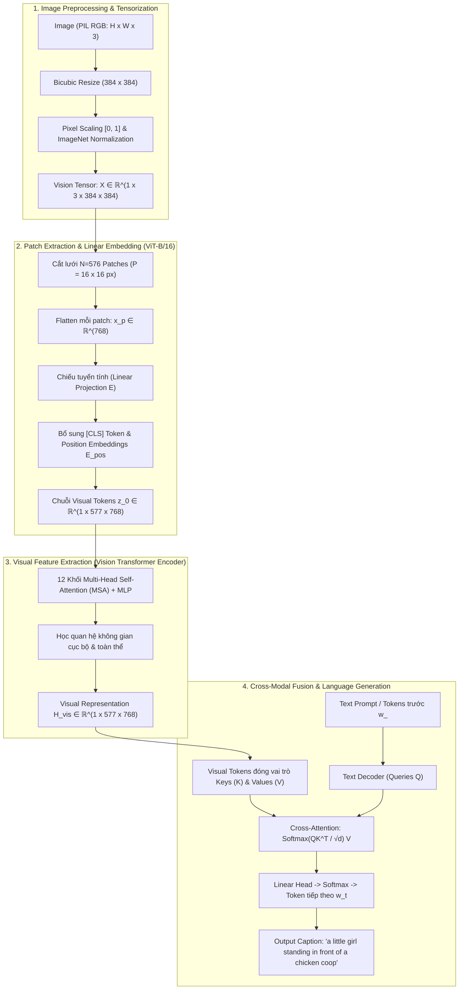

# BÀI TẬP LỚN COMPUTER VISION
## Đề tài: Image Captioning using Vision-Language Models with Fine-Tuning

[](https://www.python.org/)
[](https://pytorch.org/)
[](https://huggingface.co/docs/transformers/model_doc/blip)
[](https://streamlit.io/)

---

## 1. Giới thiệu Đề tài (Project Overview)

Image Captioning (Sinh chú thích ảnh tự động) là bài toán giao thoa đa phương thức (Multimodal) giữa **Thị giác máy tính (Computer Vision)** và **Xử lý ngôn ngữ tự nhiên (NLP)**. Nhiệm vụ của hệ thống là tiếp nhận một bức ảnh đầu vào, hiểu được các thực thể, thuộc tính và mối quan hệ không gian, sau đó sinh ra một câu mô tả chính xác nội dung bằng ngôn ngữ tự nhiên.

Trong dự án này:
- Sử dụng mô hình nền tảng: **Salesforce/blip-image-captioning-base** (kết hợp **Vision Transformer ViT-B/16** và **Cross-Attention Text Decoder**).
- Đã tải và tổ chức toàn bộ tập dữ liệu **Flickr8k thật** (8,091 ảnh JPEG, 40,460 chú thích thật kèm các file phân chia train/val/test chuẩn Karpathy).
- Xây dựng module suy luận độc lập [`src/inference.py`](file:///c:/Users/BOOK%20PRO/Downloads/btl%20computer%20vision/src/inference.py) có khả năng tự động nhận diện phần cứng (CUDA GPU -> MPS -> CPU fallback) và hiển thị chi tiết toàn bộ pipeline tiền xử lý thị giác.
- Đánh giá định lượng toàn diện bằng: **BLEU-1, BLEU-2, BLEU-3, BLEU-4, METEOR, ROUGE-L**.
- Trực quan hóa bản đồ chú ý **Cross-Attention Heatmap** (Visual Grounding).
- Triển khai ứng dụng web tương tác bằng **Streamlit**.

---

## 2. Phân Tích Chuyên Sâu Dưới Góc Nhìn Computer Vision



### 2.1. Ảnh RGB được tiền xử lý như thế nào? (Image $\to$ Preprocessing)
* **Quy trình chuẩn hóa:** Tiền xử lý thị giác được thực hiện trực tiếp bởi `BlipProcessor.from_pretrained("Salesforce/blip-image-captioning-base")` để đảm bảo độ tương thích tuyệt đối với pretrained checkpoint.
* **Spatial Resizing:** Ảnh thô (PIL RGB) được biến đổi về kích thước chuẩn $(384 \times 384)$ px bằng thuật toán **Bicubic Interpolation**.
* **Scaling:** Giá trị pixel từ số nguyên rời rạc $[0, 255]$ được chuẩn hóa về số thực trong khoảng $[0.0, 1.0]$.

### 2.2. Tensor biểu diễn ảnh như thế nào? (Preprocessing $\to$ Tensor)
* **Định dạng Chiều:** Chuyển đổi từ định dạng ảnh $\text{HWC}$ sang Tensor PyTorch $\text{BCHW}$:
  $$X \in \mathbb{R}^{B \times 3 \times 384 \times 384} \quad (\text{với } B=1 \text{ khi suy luận đơn ảnh})$$
* **Chuẩn hóa Phân phối Kênh màu (BLIP Processor Normalization - ImageNet-derived):**
  $$X_{\text{norm}}(c, i, j) = \frac{X(c, i, j) - \mu_c}{\sigma_c}$$
  với các tham số cấu hình của BLIP Processor:
  * $\mu = [0.48145466, 0.4578275, 0.40821073]$
  * $\sigma = [0.26862954, 0.26130258, 0.27577711]$
* **Ý nghĩa:** Giá trị pixel sau chuẩn hóa nằm trong đoạn $[-1.792, 2.146]$ với kỳ vọng $\text{mean} \approx 0$ và phương sai $\text{std} \approx 1$. Điều này giúp các hàm kích hoạt phi tuyến trong Transformer (như GeLU) tránh hiện tượng bão hòa gradient.

### 2.3. Vision Transformer xử lý Image Patches như thế nào? (Tensor $\to$ Vision Encoder)
* **Patch Partitioning:** Mạng $\text{ViT-B/16}$ chia ma trận ảnh $(3, 384, 384)$ thành lưới các mảnh vuông kích thước $P = 16 \times 16$ px:
  $$N = \left(\frac{384}{16}\right) \times \left(\frac{384}{16}\right) = 24 \times 24 = 576 \text{ patches}$$
* **Patch Flattening & Linear Projection:** Mỗi patch 2D $(16 \times 16 \times 3)$ được trải phẳng thành vector 1D ($D_{\text{raw}} = 768$) và nhân với ma trận chiếu học được $E \in \mathbb{R}^{768 \times 768}$.
* **Bổ sung Tọa độ Không gian:** Do cơ chế Self-Attention có tính bất biến theo vị trí (permutation-invariant), mô hình cộng thêm vector vị trí học được $E_{\text{pos}} \in \mathbb{R}^{577 \times 768}$ và chèn thêm 1 token toàn cục $x_{\text{class}}$ (`[CLS]`):
  $$z_0 = [x_{\text{class}}; x_p^1 E; x_p^2 E; \dots; x_p^{576} E] + E_{\text{pos}} \in \mathbb{R}^{1 \times 577 \times 768}$$

### 2.4. Ý nghĩa của Visual Representation (Vision Encoder $\to$ Visual Representation)
* Chuỗi $577$ visual tokens đi qua $12$ khối Transformer Encoder (Multi-Head Self-Attention + MLP).
* **Bản chất học được:** Từng patch trao đổi thông tin với toàn bộ các patch khác trên ảnh.
  * Các tầng thấp nhận diện đặc trưng cục bộ (màu sắc, hoa văn, cạnh góc).
  * Các tầng cao tổng hợp ngữ cảnh toàn thể và quan hệ không gian.
* **Đầu ra:** Ma trận biểu diễn thị giác hoàn chỉnh:
  $$H_{\text{vis}} \in \mathbb{R}^{1 \times 577 \times 768}$$

### 2.5. Visual Representation được sử dụng để sinh Caption như thế nào? (Visual Representation $\to$ Language Generation $\to$ Caption)
* **Cơ chế Cross-Attention Đa phương thức:**
  * Ma trận đặc trưng thị giác $H_{\text{vis}}$ được chiếu tuyến tính thành **Keys ($K$)** và **Values ($V$)**:
    $$K = H_{\text{vis}} W_K, \quad V = H_{\text{vis}} W_V$$
  * Các từ ngữ đã được sinh ra trước đó $w_{<t}$ được chiếu thành **Queries ($Q$)**:
    $$Q = H_{\text{text}} W_Q$$
  * Tính ma trận tương đồng Cross-Attention:
    $$\text{Cross-Attention}(Q, K, V) = \text{softmax}\left(\frac{Q K^T}{\sqrt{d_k}}\right) V$$
  * **Ý nghĩa:** Khi sinh đến từ `"chicken"`, truy vấn $Q$ sẽ kích hoạt trọng số chú ý cao nhất tại các patch $K_j$ nằm ở khu vực chuồng gà trên ảnh.
* **Beam Search Decoding ($k=5$):** Duy trì top 5 chuỗi từ có xác suất đồng thời cao nhất để sinh ra câu văn tự nhiên:
  $$\hat{S} = \arg\max_{S} \sum_{t=1}^{T} \log P(w_t \mid w_{<t}, H_{\text{vis}})$$
* **Kết quả:** `"a little girl standing in front of a chicken coop"`.

### 2.6. Visual Grounding: Phân tích Cross-Attention Heatmap theo Word hoàn chỉnh (Word-Level Grounding)

> **Khái niệm Học thuật:**
> *"Cross-attention heatmap visualizes the relative attention weights assigned by the text decoder to visual patches when generating a specific token or word."*
>
> - Heatmap được sử dụng để **giải thích hành vi mô hình (Interpretability)** và phân tích tương quan thị giác - ngôn ngữ (Visual Grounding).
> - Heatmap **không phải** là ground-truth bounding box và **không phải** là kết quả Object Detection chính xác tuyệt đối. Vùng có trọng số attention cao phản ánh mức độ tập trung đặc trưng của Decoder lên các patch tương ứng, không đồng nghĩa chắc chắn mô hình đang localization đối tượng chuẩn xác nếu không có nhãn ground-truth localization để kiểm chứng.

**Pipeline Xử Lý:**
$$\text{Word} \longrightarrow \text{Subword tokens} \longrightarrow \text{Cross-Attention} \longrightarrow 576 \text{ visual patches} \longrightarrow 24 \times 24 \text{ spatial grid} \longrightarrow \text{Heatmap} \longrightarrow \text{Overlay}$$

#### A. Tại sao một Word có thể gồm nhiều Subword Tokens?
* BLIP sử dụng bộ từ vựng cố định (~30,522 tokens) dựa trên thuật toán **WordPiece Tokenization (BERT)**.
* Khi gặp các từ hiếm, từ ghép hoặc biến thể hình thái học (ví dụ: từ ngữ cảnh thời trang `"croche"`, từ ghép `"motorcycles"`), tokenizer chia nhỏ thành các **subwords**:
  $$\text{"croche"} \longrightarrow [13675: \text{"cr"}] + [23555: \text{"##oche"}]$$
  Dấu tiền tố `##` biểu thị subword này nối tiếp liền mạch với subword đứng trước để tạo thành 1 từ hoàn chỉnh.

#### B. Tại sao cần gộp Cross-Attention (Attention Aggregation)?
* Trong Text Decoder, mỗi subword token (ví dụ: `"cr"` và `"##oche"`) gửi truy vấn Query ($Q$) độc lập đến $576$ visual patches ($K, V$) của $\text{ViT-B/16}$.
* Để quan sát sự chú ý thị giác của **toàn bộ khái niệm ngữ nghĩa (semantic word)**, hệ thống tự động gộp các vector attention tương ứng bằng phép toán trung bình cộng:
  $$A_{\text{word}} = \frac{1}{|T_{\text{word}}|} \sum_{t \in T_{\text{word}}} A_t \in \mathbb{R}^{576}$$
  Với từ chỉ gồm 1 token duy nhất (như `"wearing"`, `"hat"`), vector attention được sử dụng trực tiếp ($|T|=1$).

#### C. Xử lý Trùng Lặp Từ (Repeated Words Disambiguation)
* Khi một từ xuất hiện nhiều lần ở các vị trí ngữ cảnh khác nhau (ví dụ: `"a man wearing a croche hat ... in a room"` có 3 từ `"a"`):
  * Hệ thống quản lý theo bộ chỉ số định danh: `(word_index, token_indices)`.
  * Vị trí `"a"` #1 ($t=1$), `"a"` #4 ($t=4$), `"a"` #10 ($t=11$) được phân tích hoàn toàn độc lập, kích hoạt các vùng patch thị giác riêng biệt (Patch #311, Patch #48, Patch #408).

#### D. Chuẩn hóa Khử Điểm Trũng Thị Giác ViT (Spatial Z-score Relevance)
* Trong Vision Transformer, một số patch nền/biên có chuẩn vector lớn (Attention Sink) thường nhận attention nền chung từ tất cả các token.
* Thuật toán áp dụng chuẩn hóa $Z$-score theo chuỗi câu để cô lập trọng số kích hoạt đặc thù của từ:
  $$R(t, j) = \text{ReLU}\left(\frac{A(t, j) - \mu_j}{\sigma_j}\right)$$
  Sau đó định hình thành ma trận không gian $24 \times 24$, nội suy song bậc ba (Bicubic) lên kích thước ảnh gốc và tạo bản đồ nhiệt (Heatmap Overlay).

---

## 3. Hướng dẫn Chạy Suy Luận (Pretrained BLIP Inference)

### 3.1. Chạy với ảnh bất kỳ qua Command Line
```bash
python src/inference.py --image data/flickr8k/Images/1000268201_693b08cb0e.jpg
```
*(Nếu không truyền tham số `--image`, script sẽ tự động lấy ảnh mẫu đầu tiên trong tập Flickr8k).*

### 3.2. Tùy chỉnh tham số giải mã
```bash
python src/inference.py --image path/to/your_image.jpg --num_beams 5 --max_length 32
```

### 3.3. Kết quả lưu tự động
Toàn bộ kết quả suy luận cùng thông số chi tiết của pipeline tiền xử lý thị giác được tự động lưu vào thư mục `results/predictions/`:
* File JSON: `results/predictions/<image_name>_prediction.json`
* File Text: `results/predictions/<image_name>_prediction.txt`

---

## 4. Huấn luyện Fine-Tuning Pipeline (Phần 6)

Mô hình hỗ trợ 2 chiến lược fine-tuning linh hoạt:
1. **Frozen Vision ViT (`frozen_vision`):** Đóng băng 86M tham số của Vision Transformer, chỉ huấn luyện 138M tham số của Text Decoder. Tiết kiệm VRAM, huấn luyện nhanh trên GPU nhỏ.
2. **Full Fine-Tuning (`full_finetune`):** Huấn luyện toàn bộ mô hình với **Differential Learning Rate** (ViT học với $\text{LR} = 5 \times 10^{-6}$, Decoder học với $\text{LR} = 5 \times 10^{-5}$) để tránh catastrophic forgetting các đặc trưng thị giác cốt lõi.

### 4.1. Lệnh chạy Huấn luyện (Command Line Interface)
```bash
# Huấn luyện chiến lược Frozen Vision (Khuyên dùng khi bắt đầu)
python src/train.py --strategy frozen_vision --epochs 5 --batch_size 16 --learning_rate 5e-5

# Huấn luyện Full Fine-Tuning (Differential LR cho ViT & Decoder)
python src/train.py --strategy full_finetune --epochs 5 --batch_size 16 --learning_rate 5e-5 --lr_vision 5e-6 --weight_decay 0.05
```

### 4.2. Các siêu tham số cho phép cấu hình (Hyperparameters)
| Tham số | Ý nghĩa | Mặc định |
| :--- | :--- | :--- |
| `--strategy` | Chiến lược huấn luyện (`frozen_vision` hoặc `full_finetune`) | `frozen_vision` |
| `--epochs` | Số lượng epoch huấn luyện | `5` |
| `--batch_size` | Kích thước batch | `16` |
| `--learning_rate` | Tốc độ học của Language Decoder | `5e-5` |
| `--lr_vision` | Tốc độ học của Vision Encoder (khi full fine-tune) | `5e-6` |
| `--max_length` | Độ dài tối đa của caption tokens | `32` |
| `--weight_decay` | Hệ số suy giảm trọng số (AdamW) | `0.05` |
| `--mixed_precision` | Kích hoạt tự động FP16 (AMP) trên GPU | `True` |

### 4.3. Logging và Quản lý Checkpoint
- **Training Logs:** Quá trình huấn luyện tự động ghi lại loss theo từng step và epoch vào:
  * `logs/training_log_<strategy>.json`
  * `logs/training_log_<strategy>.csv`
- **Best Checkpoint:** Sau mỗi epoch validation, nếu validation loss đạt kỷ lục thấp nhất mới, mô hình sẽ tự động lưu trọng số tốt nhất vào:
  * `checkpoints/<strategy>/best_model/`

---

## 5. Kết Quả Đánh Giá & So Sánh Thực Nghiệm (Evaluation Results)

Kết quả đánh giá chính thức được thực hiện đối đầu trực tiếp giữa **Pretrained BLIP (`Salesforce/blip-image-captioning-base`)** và **Fine-Tuned BLIP (`checkpoints/frozen_vision/best_model/`)** trên toàn bộ tập kiểm thử chuẩn Flickr8k.

### 5.1. Giao thức Đánh giá (Evaluation Protocol)
* **Tập dữ liệu kiểm thử:** Toàn bộ $1,000$ ảnh test chuẩn từ `data/flickr8k/splits/Flickr_8k.testImages.txt` (hoàn toàn cô lập khỏi tập train/validation).
* **Ground-Truth References:** $5,000$ câu chú thích chuẩn người dùng từ `data/flickr8k/captions.txt` (đúng $5$ reference captions cho mỗi ảnh test).
* **Cấu hình Sinh chuỗi (Generation Settings):** Cả 2 mô hình sử dụng cùng cấu hình Beam Search:
  * `method = "beam_search"`
  * `num_beams = 3`
  * `max_length = 32`
* **Xử lý Ngôn ngữ & Tokenization:** Sử dụng cùng bộ tokenizer, tiền xử lý chữ thường (lowercased) và tách từ thống nhất.
* **Chỉ số Đánh giá (Metrics):**
  * **BLEU-1, BLEU-2, BLEU-3, BLEU-4:** Tính theo NLTK `corpus_bleu` kết hợp hàm làm mịn Chen & Cherry Smoothing Method 1.
  * **METEOR:** Tính theo NLTK `meteor_score` đối chiếu với 5 references của mỗi ảnh, lấy trung bình toàn tập test.
  * **ROUGE-L:** Tính điểm F1 của Longest Common Subsequence lớn nhất với 5 references qua thư viện `rouge-score` (use_stemmer=True), lấy trung bình toàn tập test.
* **Độ toàn vẹn dữ liệu:** $1,000$ ảnh xử lý hoàn chỉnh, $0$ ảnh lỗi/thiếu, $0$ reference bị thiếu, $0$ giá trị NaN.
* **Thời gian thực thi:** $5,742.63$ giây (~$95.71$ phút trên CPU).
* **Dữ liệu xuất chính thức:**
  * Thống kê tổng hợp: [`outputs/full_test_1000.json`](file:///c:/Users/BOOK%20PRO/Downloads/btl%20computer%20vision/outputs/full_test_1000.json)
  * Chi tiết 1,000 dự đoán: [`outputs/predictions/full_test_1000.json`](file:///c:/Users/BOOK%20PRO/Downloads/btl%20computer%20vision/outputs/predictions/full_test_1000.json)

### 5.2. Bảng Kết Quả Đánh Giá Chính Thức (Official Quantitative Results - 1,000 Test Images)

| Chỉ số (Metric) | Pretrained BLIP (`Salesforce/blip-image-captioning-base`) | Fine-Tuned BLIP (`checkpoints/frozen_vision/best_model/`) | Mức chênh lệch tuyệt đối (Điểm phần trăm / percentage points) |
| :--- | :---: | :---: | :---: |
| **BLEU-1** | 58.99% | **71.15%** | **+12.16 percentage points** |
| **BLEU-2** | 45.08% | **54.86%** | **+9.78 percentage points** |
| **BLEU-3** | 33.37% | **40.65%** | **+7.28 percentage points** |
| **BLEU-4** | 24.50% | **29.33%** | **+4.83 percentage points** |
| **METEOR** | 37.19% | **44.40%** | **+7.21 percentage points** |
| **ROUGE-L** | 49.40% | **53.25%** | **+3.85 percentage points** |

*Ghi chú:* Độ chênh lệch được đo bằng điểm phần trăm (percentage points - pp) phản ánh sự gia tăng trực tiếp trên thang điểm chuẩn $0-100\%$.

### 5.3. Mẫu So Sánh Định Tính Trực Quan (Qualitative Samples)
*Mẫu trích xuất thực tế từ tập test chính thức `outputs/predictions/full_test_1000.json`:*

| Ảnh (Image) | Ground Truth (5 References) | Pretrained BLIP (Exp 1) | Fine-Tuned BLIP (Exp 2) | Nhận xét Chuyên Môn |
| :---: | :--- | :--- | :--- | :--- |
| `3385593926_d3e9c21170.jpg` | • The dogs are in the snow in front of a fence .<br>• The dogs play on the snow .<br>• Two brown dogs playfully fight in the snow .<br>• Two brown dogs wrestle in the snow .<br>• Two dogs playing in the snow . | `two dogs playing in the snow` | `a couple of dogs playing in the snow` | Cả hai mô hình đều nhận diện chính xác hành vi thực thể trong tuyết |
| `2677656448_6b7e7702af.jpg` | • a brown and white dog swimming towards some in the pool<br>• A dog in a swimming pool swims toward sombody we cannot see .<br>• A dog swims in a pool near a person .<br>• Small dog is paddling through the water in a pool .<br>• The small brown and white dog is in the pool . | `a man in a swimming pool with a dog` | `a man and a dog in a swimming pool` | Miêu tả chính xác quan hệ không gian thực thể người và chó trong hồ bơi |
| `311146855_0b65fdb169.jpg` | • A man and a woman in festive costumes dancing .<br>• A man and a woman with feathers on her head dance .<br>• A man and a woman wearing decorative costumes and dancing in a crowd of onlookers .<br>• one performer wearing a feathered headdress dancing with another performer in the streets<br>• Two people are dancing with drums on the right and a crowd behind them . | `a man in a costume` | `a man in a yellow and green costume` | Mô hình fine-tuned bổ sung chi tiết màu sắc cụ thể (`yellow and green`) |

### 5.4. Thiết Kế Thí Nghiệm Đảm Bảo Tính Công Bằng Tuyệt Đối (Fairness Guarantees)
1. **Zero Data Leakage:** Phân chia tập dữ liệu train/val/test theo chuẩn Karpathy Split nghiêm ngặt. Tập Test (1,000 ảnh) hoàn toàn cô lập, không xuất hiện trong quá trình huấn luyện hay tinh chỉnh siêu tham số.
2. **Identical Vision Preprocessing:** Cả 2 mô hình đều áp dụng cùng một pipeline tiền xử lý: Bicubic Interpolation về kích thước chuẩn $(384 \times 384)$ px và chuẩn hóa kênh màu theo **BLIP Processor Normalization** ($\mu=[0.481, 0.458, 0.408], \sigma=[0.269, 0.261, 0.276]$).
3. **Controlled Decoding Parameters:** Cùng sử dụng thuật toán **Beam Search** với $k=3$, $\text{max\_length}=32$.
4. **Multi-Reference Ground Truths:** Mỗi ảnh test được đối chiếu với đầy đủ 5 câu chú thích của con người để tính toán sự tương đồng ngữ nghĩa chính xác nhất.
5. **BLEU Smoothing Function:** Áp dụng phương pháp làm mịn Chen & Cherry Smoothing Method 1 để tránh phạt điểm 0 khi câu ngắn không khớp $n$-gram bậc cao.
6. **Môi trường Đánh giá Đồng nhất:** Chạy trên cùng thiết bị phần cứng (CPU) và cùng độ chính xác số học.

### 5.5. Giới Hạn Của Nghiên Cứu (Limitations)
* **Bản chất của các thước đo tự động (NLP Metrics):** Các chỉ số BLEU, METEOR, ROUGE-L đo lường độ trùng lặp $n$-gram và sự tương đồng cú pháp/ngữ nghĩa giữa câu sinh ra với các câu tham chiếu do con người viết, không thể đánh giá toàn diện mọi sắc thái thẩm mỹ hay tính sáng tạo tự nhiên của ngôn ngữ.
* **Bản đồ chú ý thị giác (Attention Visualization):** Visual Grounding thông qua Cross-Attention Heatmap là phương pháp phân tích diễn giải mô hình (interpretability analysis), phản ánh mức độ tập trung đặc trưng của Decoder lên các patch thị giác, không phải là ground-truth object localization hay bounding box phát hiện đối tượng chính xác tuyệt đối.
* **Phạm vi phân phối dữ liệu (Domain Scope):** Toàn bộ kết quả thực nghiệm được đo lường trên tập dữ liệu Flickr8k (chủ yếu xoay quanh các hoạt động thường ngày, con người và động vật ngoại cảnh). Kết quả này đặc thù cho phân phối dữ liệu của Flickr8k và không nên được khái quát hóa thành kết luận tổng quát cho mọi bài toán hay tập dữ liệu image captioning khác.

---

## 6. Vẽ Biểu đồ Hội tụ & Visual Grounding (Visualizer)

```bash
# Vẽ đường cong Training Loss & Validation Loss từ log
python src/visualizer.py --plot_loss logs/training_log_frozen_vision.json

# Tạo bản đồ chú ý thị giác Cross-Attention Heatmaps
python src/visualizer.py --image data/flickr8k/Images/1000268201_693b08cb0e.jpg
```

---

## 7. Cấu trúc Thư mục Dự án

```text
btl-computer-vision/
├── app/
│   └── app.py                      # Giao diện Web tương tác Streamlit
├── data/
│   ├── flickr8k/                   # Thư mục dữ liệu Flickr8k thật (8,091 ảnh)
│   │   ├── Images/                 # 8,091 ảnh JPEG thật
│   │   ├── captions.txt            # 40,460 captions chuẩn hóa
│   │   ├── Flickr8k.token.txt      # File raw token gốc
│   │   └── splits/                 # Flickr_8k.trainImages.txt, devImages.txt, testImages.txt
│   ├── download_and_extract_flickr8k.py
│   ├── fast_parallel_download.py   # Script tải song song 8 luồng tự động retry
│   └── finalize_dataset.py         # Script chuẩn hóa dữ liệu
├── src/
│   ├── __init__.py
│   ├── config.py                   # Cấu hình hyperparameters & đường dẫn
│   ├── dataset_pipeline.py         # Pipeline xử lý dữ liệu, kiểm tra lỗi & thống kê
│   ├── dataset.py                  # PyTorch Dataset & DataLoader
│   ├── model.py                    # Wrapper BLIP: Freeze/Unfreeze ViT, Differential LR
│   ├── train.py                    # Training loop, LR scheduling, AMP, checkpointing
│   ├── evaluate.py                 # Tính toán BLEU 1-4, METEOR, ROUGE-L
│   ├── inference.py                # Pipeline suy luận Pretrained BLIP chuẩn hóa
│   ├── visualizer.py               # Trực quan hóa Attention Heatmap & biểu đồ hội tụ
│   └── utils.py                    # Tiện ích tái lập (seed), logger, I/O
├── results/
│   ├── figures/                    # 4 biểu đồ phân tích thống kê Flickr8k thật
│   └── predictions/                # Kết quả caption dự đoán (JSON + TXT)
├── outputs/
│   ├── full_test_1000.json         # Thống kê và metrics đánh giá chính thức (1,000 test images)
│   ├── predictions/
│   │   └── full_test_1000.json     # Chi tiết 1,000 predictions & 5,000 ground-truth references
│   └── comparison_report.md        # Báo cáo đối đầu định lượng & định tính chi tiết
├── compare_experiments.py          # Pipeline so sánh thực nghiệm Pretrained vs Fine-Tuned
├── dataset_analysis.py             # Script phân tích EDA Flickr8k
├── inference.py                    # Wrapper chạy suy luận từ thư mục gốc
├── checkpoints/                    # Lưu model weights sau khi train (local)
├── logs/                           # Nhật ký huấn luyện JSON / log
├── requirements.txt                # Thư viện phụ thuộc
└── README.md                       # Báo cáo học thuật chi tiết
```

---

## 8. Khởi chạy Ứng dụng Demo Streamlit

```bash
streamlit run app/app.py
```
Giao diện cung cấp:
- Duyệt trực tiếp toàn bộ kho $8,091$ ảnh Flickr8k thật hoặc tải ảnh mới.
- Sinh caption tức thì kèm đồng hồ đo độ trễ suy luận ($\text{ms}$).
- Trực quan hóa **Visual Attention Heatmap** cho từng từ khóa để kiểm tra vùng thị giác được Vision Encoder chú ý.
- Bảng và biểu đồ so sánh chỉ số BLEU, METEOR, ROUGE-L.


