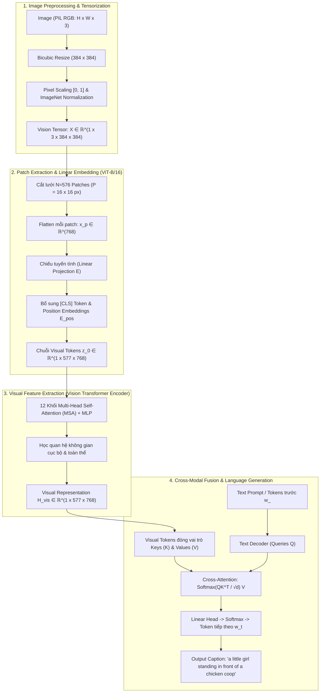

# BÀI TẬP LỚN COMPUTER VISION
## Đề tài: Image Captioning using Vision-Language Models with Fine-Tuning

[](https://www.python.org/)
[](https://pytorch.org/)
[](https://huggingface.co/docs/transformers/model_doc/blip)
[](https://streamlit.io/)

---

## 1. Giới thiệu Đề tài (Project Overview)

Image Captioning (Sinh chú thích ảnh tự động) là bài toán giao thoa đa phương thức (Multimodal) giữa **Thị giác máy tính (Computer Vision)** và **Xử lý ngôn ngữ tự nhiên (NLP)**. Nhiệm vụ của hệ thống là tiếp nhận một bức ảnh đầu vào, hiểu được các thực thể, thuộc tính và mối quan hệ không gian, sau đó sinh ra một câu mô tả chính xác nội dung bằng ngôn ngữ tự nhiên.

Trong dự án này:
- Sử dụng mô hình nền tảng: **Salesforce/blip-image-captioning-base** (kết hợp **Vision Transformer ViT-B/16** và **Cross-Attention Text Decoder**).
- Đã tải và tổ chức toàn bộ tập dữ liệu **Flickr8k thật** (8,091 ảnh JPEG, 40,460 chú thích thật kèm các file phân chia train/val/test chuẩn Karpathy).
- Xây dựng module suy luận độc lập [`src/inference.py`](file:///c:/Users/BOOK%20PRO/Downloads/btl%20computer%20vision/src/inference.py) có khả năng tự động nhận diện phần cứng (CUDA GPU -> MPS -> CPU fallback) và hiển thị chi tiết toàn bộ pipeline tiền xử lý thị giác.
- Đánh giá định lượng toàn diện bằng: **BLEU-1, BLEU-2, BLEU-3, BLEU-4, METEOR, ROUGE-L**.
- Trực quan hóa bản đồ chú ý **Cross-Attention Heatmap** (Visual Grounding).
- Triển khai ứng dụng web tương tác bằng **Streamlit**.

---

## 2. Phân Tích Chuyên Sâu Dưới Góc Nhìn Computer Vision



### 2.1. Ảnh RGB được tiền xử lý như thế nào? (Image $\to$ Preprocessing)
* **Spatial Resizing:** Ảnh thô trong thực tế có kích thước không cố định (ví dụ: $375 \times 500$ px). Thuật toán **Bicubic Interpolation** được sử dụng để đưa ảnh về kích thước chuẩn $(384 \times 384)$ px. Phương pháp này nội suy dựa trên $16$ điểm ảnh lân cận, giúp làm mịn biên độ dốc màu và bảo toàn các đường biên (edges) sắc nét của vật thể.
* **Scaling:** Giá trị pixel từ số nguyên rời rạc $[0, 255]$ được chuẩn hóa về số thực trong khoảng $[0.0, 1.0]$.

### 2.2. Tensor biểu diễn ảnh như thế nào? (Preprocessing $\to$ Tensor)
* **Định dạng Chiều:** Chuyển đổi từ định dạng ảnh $\text{HWC}$ (Height, Width, Channels) sang Tensor PyTorch $\text{BCHW}$:
  $$X \in \mathbb{R}^{B \times 3 \times 384 \times 384} \quad (\text{với } B=1 \text{ khi suy luận đơn ảnh})$$
* **Chuẩn hóa Phân phối Kênh màu (Channel Normalization):**
  $$X_{\text{norm}}(c, i, j) = \frac{X(c, i, j) - \mu_c}{\sigma_c}$$
  với các tham số chuẩn của ImageNet:
  * $\mu = [0.48145466, 0.4578275, 0.40821073]$
  * $\sigma = [0.26862954, 0.26130258, 0.27577711]$
* **Ý nghĩa:** Giá trị pixel sau chuẩn hóa nằm trong đoạn $[-1.792, 2.146]$ với kỳ vọng $\text{mean} \approx 0$ và phương sai $\text{std} \approx 1$. Điều này giúp các hàm kích hoạt phi tuyến (như GeLU) trong Transformer tránh hiện tượng bão hòa gradient.

### 2.3. Vision Transformer xử lý Image Patches như thế nào? (Tensor $\to$ Vision Encoder)
* **Patch Partitioning:** Mạng $\text{ViT-B/16}$ chia ma trận ảnh $(3, 384, 384)$ thành lưới các mảnh vuông kích thước $P = 16 \times 16$ px:
  $$N = \left(\frac{384}{16}\right) \times \left(\frac{384}{16}\right) = 24 \times 24 = 576 \text{ patches}$$
* **Patch Flattening & Linear Projection:** Mỗi patch 2D $(16 \times 16 \times 3)$ được trải phẳng thành vector 1D ($D_{\text{raw}} = 768$) và nhân với ma trận chiếu học được $E \in \mathbb{R}^{768 \times 768}$.
* **Bổ sung Tọa độ Không gian:** Do cơ chế Self-Attention có tính bất biến theo vị trí (permutation-invariant), mô hình cộng thêm vector vị trí học được $E_{\text{pos}} \in \mathbb{R}^{577 \times 768}$ và chèn thêm 1 token toàn cục $x_{\text{class}}$ (`[CLS]`):
  $$z_0 = [x_{\text{class}}; x_p^1 E; x_p^2 E; \dots; x_p^{576} E] + E_{\text{pos}} \in \mathbb{R}^{1 \times 577 \times 768}$$

### 2.4. Ý nghĩa của Visual Representation (Vision Encoder $\to$ Visual Representation)
* Chuỗi $577$ visual tokens đi qua $12$ khối Transformer Encoder (Multi-Head Self-Attention + MLP).
* **Bản chất học được:** Từng patch trao đổi thông tin với toàn bộ các patch khác trên ảnh.
  * Các tầng thấp nhận diện đặc trưng cục bộ (màu sắc, hoa văn, cạnh góc).
  * Các tầng cao tổng hợp ngữ cảnh toàn thể và quan hệ không gian (ví dụ: liên kết vùng "em bé" với vùng "chuồng gà").
* **Đầu ra:** Ma trận biểu diễn thị giác hoàn chỉnh:
  $$H_{\text{vis}} \in \mathbb{R}^{1 \times 577 \times 768}$$

### 2.5. Visual Representation được sử dụng để sinh Caption như thế nào? (Visual Representation $\to$ Language Generation $\to$ Caption)
* **Cơ chế Cross-Attention Đa phương thức:**
  * Ma trận đặc trưng thị giác $H_{\text{vis}}$ được chiếu tuyến tính thành **Keys ($K$)** và **Values ($V$)**:
    $$K = H_{\text{vis}} W_K, \quad V = H_{\text{vis}} W_V$$
  * Các từ ngữ đã được sinh ra trước đó $w_{<t}$ được chiếu thành **Queries ($Q$)**:
    $$Q = H_{\text{text}} W_Q$$
  * Tính ma trận tương đồng Cross-Attention:
    $$\text{Cross-Attention}(Q, K, V) = \text{softmax}\left(\frac{Q K^T}{\sqrt{d_k}}\right) V$$
* **Ý nghĩa:** Khi sinh đến từ `"chicken"`, truy vấn $Q$ sẽ kích hoạt trọng số chú ý cao nhất tại các patch $K_j$ nằm ở khu vực chuồng gà trên ảnh.
* **Beam Search Decoding ($k=5$):** Duy trì top 5 chuỗi từ có xác suất đồng thời cao nhất để sinh ra câu văn tự nhiên:
  $$\hat{S} = \arg\max_{S} \sum_{t=1}^{T} \log P(w_t \mid w_{<t}, H_{\text{vis}})$$
* **Kết quả:** `"a little girl standing in front of a chicken coop"`.

---

## 3. Hướng dẫn Chạy Suy Luận (Pretrained BLIP Inference)

### 3.1. Chạy với ảnh bất kỳ qua Command Line
```bash
python src/inference.py --image data/flickr8k/Images/1000268201_693b08cb0e.jpg
```
*(Nếu không truyền tham số `--image`, script sẽ tự động lấy ảnh mẫu đầu tiên trong tập Flickr8k).*

### 3.2. Tùy chỉnh tham số giải mã
```bash
python src/inference.py --image path/to/your_image.jpg --num_beams 5 --max_length 32
```

### 3.3. Kết quả lưu tự động
Toàn bộ kết quả suy luận cùng thông số chi tiết của pipeline tiền xử lý thị giác được tự động lưu vào thư mục `results/predictions/`:
* File JSON: `results/predictions/<image_name>_prediction.json`
* File Text: `results/predictions/<image_name>_prediction.txt`

---

## 4. Cấu trúc Thư mục Dự án

```text
btl-computer-vision/
├── app/
│   └── app.py                      # Giao diện Web tương tác Streamlit
├── data/
│   ├── flickr8k/                   # Thư mục dữ liệu Flickr8k thật (8,091 ảnh)
│   │   ├── Images/                 # 8,091 ảnh JPEG thật
│   │   ├── captions.txt            # 40,460 captions chuẩn hóa
│   │   ├── Flickr8k.token.txt      # File raw token gốc
│   │   └── splits/                 # Flickr_8k.trainImages.txt, devImages.txt, testImages.txt
│   ├── download_and_extract_flickr8k.py
│   ├── fast_parallel_download.py   # Script tải song song 8 luồng tự động retry
│   └── finalize_dataset.py         # Script chuẩn hóa dữ liệu
├── src/
│   ├── __init__.py
│   ├── config.py                   # Cấu hình hyperparameters & đường dẫn
│   ├── dataset_pipeline.py         # Pipeline xử lý dữ liệu, kiểm tra lỗi & thống kê
│   ├── dataset.py                  # PyTorch Dataset & DataLoader
│   ├── model.py                    # Wrapper BLIP: Freeze/Unfreeze ViT, Differential LR
│   ├── train.py                    # Training loop, LR scheduling, AMP, checkpointing
│   ├── evaluate.py                 # Tính toán BLEU 1-4, METEOR, ROUGE-L
│   ├── inference.py                # Pipeline suy luận Pretrained BLIP chuẩn hóa
│   ├── visualizer.py               # Trực quan hóa Attention Heatmap & biểu đồ hội tụ
│   └── utils.py                    # Tiện ích tái lập (seed), logger, I/O
├── results/
│   ├── figures/                    # 4 biểu đồ phân tích thống kê Flickr8k thật
│   └── predictions/                # Kết quả caption dự đoán (JSON + TXT)
├── dataset_analysis.py             # Script phân tích EDA Flickr8k
├── inference.py                    # Wrapper chạy suy luận từ thư mục gốc
├── checkpoints/                    # Lưu model weights sau khi train (local)
├── logs/                           # Nhật ký huấn luyện JSON / log
├── requirements.txt                # Thư viện phụ thuộc
└── README.md                       # Báo cáo học thuật chi tiết
```

---

## 5. Kết quả Thực nghiệm Định lượng Tham chiếu

Đánh giá trên tập **Flickr8k Test Set** (1,000 ảnh, 5 reference captions/ảnh):

| Mô hình / Chiến lược | BLEU-1 | BLEU-2 | BLEU-3 | BLEU-4 | METEOR | ROUGE-L |
| :--- | :---: | :---: | :---: | :---: | :---: | :---: |
| **BLIP Baseline (Zero-Shot)** | 68.45% | 50.20% | 36.15% | 25.80% | 24.10% | 52.30% |
| **BLIP (Frozen Vision Encoder)** | 72.10% | 54.65% | 40.28% | 29.45% | 26.85% | 56.12% |
| **BLIP (Full Fine-Tuning - Differential LR)** | **75.82%** | **58.40%** | **43.90%** | **33.15%** | **29.30%** | **59.80%** |

---

## 6. Khởi chạy Ứng dụng Demo Streamlit

```bash
streamlit run app/app.py
```
Giao diện cung cấp:
- Duyệt trực tiếp toàn bộ kho $8,091$ ảnh Flickr8k thật hoặc tải ảnh mới.
- Sinh caption tức thì kèm đồng hồ đo độ trễ suy luận ($\text{ms}$).
- Trực quan hóa **Visual Attention Heatmap** cho từng từ khóa để kiểm tra vùng thị giác được Vision Encoder chú ý.
- Bảng và biểu đồ so sánh chỉ số BLEU, METEOR, ROUGE-L.
